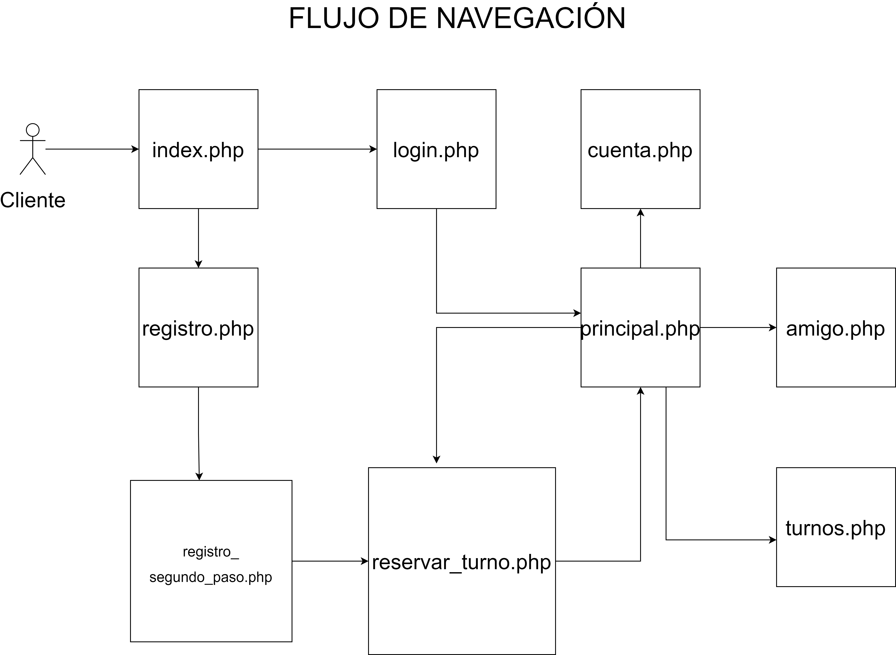
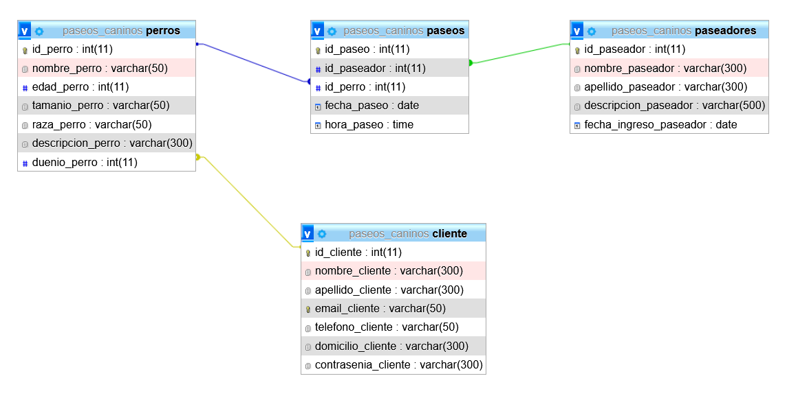
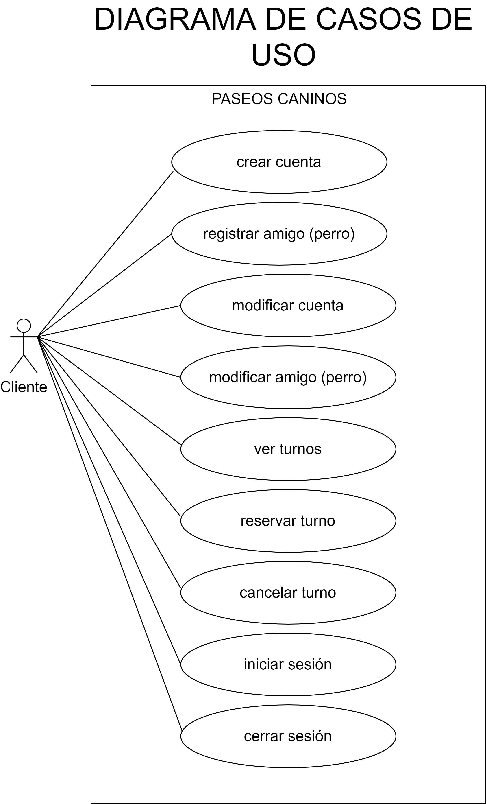
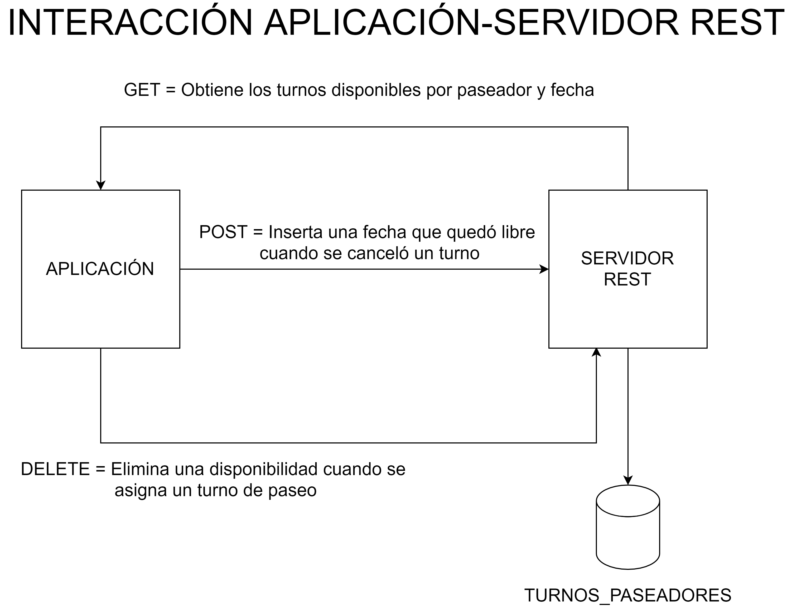
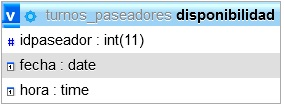

# PASEOS CANIN@S - RESERVAS DE TURNOS
INTERFACES Y PROGRAMACIÓN VISUAL - TRABAJO INTEGRADOR DE CURSADA

“Paseos Caninos” en una aplicación web en donde un usuario podrá registrarse junto a su amig@ canin@ para poder reservar turnos de paseos. A continuación, se muestra el diagrama que representa el flujo de navegación. 

 

 <h2>MODELO RELACIONAL</h2>
La base de datos que usa el sistema cuenta con cuatro tablas:
 
<ul>
  <li>CLIENTE</li>
<li>PERROS</li>
<li>PASEADORES</li>
<li>PASEOS</li>
</ul>

Y se relacionan de la siguiente manera

<h2>FUNCIONES DISPONIBLES</h2>
En la aplicación, un usuario podrá: 

<ul> 
  <li><b>Registrarse:</b> darse de alta en el sistema proporcionando datos necesarios y también registrará a su perro. Si el proceso es correcto, se inicia una sesión (de forma implícita, es decir, sin ingresar email y contraseña). Este proceso inserta un nuevo registro en la tabla ‘CLIENTE’ y en la tabla ‘PERROS’.</li> 
<li><b>Iniciar sesión:</b> mediante el uso de su email y contraseña. Si los datos ingresados son correctos, se genera una sesión para tener los datos del cliente y de su perro. Este proceso consulta a las tablas ‘CLIENTE’ y ‘PERROS’.</li> 
<li><b>Cerrar sesión:</b> este proceso elimina la sesión activa. Lo puede hacer desde cualquier sección.</li> 
<li><b>Reservar turno:</b> primero debe elegir un paseador y para dicho paseador, elegir una fecha, luego, se le mostrará los horarios disponibles para esa fecha (en caso de que exista). Una vez asignado el turno, podrá visualizarlo en la sección “Turnos”. Este proceso inserta un nuevo registro en la tabla ‘PASEOS’. Para mostrar los datos de los paseadores, se consulta la tabla ‘PASEADORES’. Para mostrar la disponibilidad horaria según fecha, se consume un servicio REST.</li> 
<li><b>Ver listado de turnos:</b> listado accesible desde la sección “Turnos”. Allí, podrá cancelarlo. Este proceso consulta a la tabla ‘PASEOS’.</li> 
<li><b>Cancelar turno:</b> desde la sección “Turnos”. Este proceso elimina un registro de la tabla “PASEOS”.</li> 
<li><b>Modificar cuenta:</b> desde la sección “Cuenta”. Actualiza un registro en la tabla ‘CLIENTE’.</li> 
<li><b>Modificar datos del perro:</b> desde la sección “Amig@”. Actualiza un registro en la tabla ‘PERROS’.</li>
 </ul>
 
  
 
<h2>INTERACCIÓN CON EL SERVICIO REST</h2>
La aplicación interactúa con un servicio REST desde donde obtiene, por medio de una solicitud GET, la disponibilidad horaria de los paseadores. Cuando se reserva un turno, la aplicación envía una solicitud DELETE para que se elimine la disponibilidad horaria asociada al paseador para el cual se reservó un turno. Cuando el cliente cancela un turno, la aplicación realiza una solicitud POST hacia el servicio para insertar la disponibilidad que fue liberada.

 

 La base de datos usada por el servicio sólo contiene una tabla constituída de la siguiente manera: 
 

## DESARROLLO
Para el desarrollo de la aplicación se utilizó:
<ul>
<li>PHP</li>
<li>Mysql</li>
<li>Bootstrap</li>
<li>HTML5</li>
<li>CSS3</li>
<li>JQuery, javascript</li>
 </ul>
